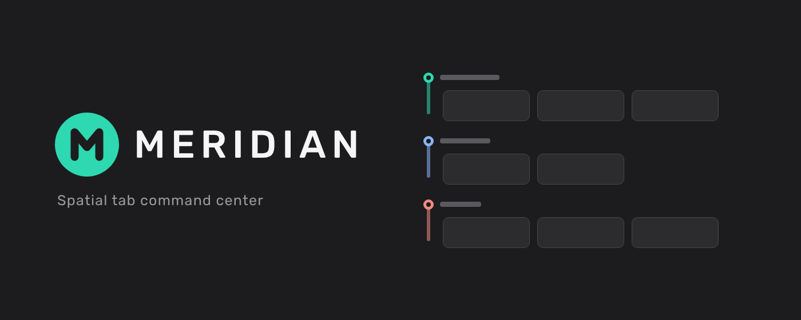

# Meridian

**Spatial tab command center** — a Chrome extension that replaces your new-tab page with a visual tab manager.

## Features

### Tab Cards & Workspace Lanes
Tabs are displayed as live thumbnail cards, organized into **workspace lanes** that map to Chrome tab groups or Meridian custom groups. Lanes are collapsible and support drag-and-drop tab reordering within and across groups.

### Lightbox Preview
Hover a tab card for 2 seconds to open a full-size preview lightbox showing the tab's thumbnail, title, and URL. Click to navigate to the tab, or press `Esc` to dismiss.

### Search Bar
A multi-engine search bar sits at the top of every new-tab page. Switch between **Google**, **DuckDuckGo**, **Bing**, and **Brave** with a single click on the engine logo. Your preference is saved across sessions.

### Local Search
Open-tab search is available by default. Bookmark and history search are
optional: Meridian asks for the corresponding Chrome permission only when you
enable that source in **Settings → Local Search** or select its search scope.
If access is denied or later revoked, that source stays off and Meridian does
not query its API.

### Tab Organization
Enable **Group unsorted tabs by domain** to automatically cluster ungrouped tabs by site, reducing visual noise.

### New Tab Behavior
Configure what happens when you open a new tab:
- Open a new Meridian view
- Always return to a pinned Meridian tab
- Open a custom homepage URL

## Theming
Choose **Light**, **Dark**, or **System** (follows OS preference). The selected theme is synced via `chrome.storage.sync`.

### Background Customization
Pick from:
- **Solid colors** — Black, Ink, Midnight, Forest, Plum
- **Gradient presets** — Midnight, Ocean, Dusk, Emerald, Amber, Bloom
- **Photos** — 12 curated images from Picsum (refresh for a new set)
- **Custom image** — upload any image from your device

## Keyboard Navigation

| Key | Action |
|---|---|
| `Ctrl+Shift+M` | Focus your Meridian tab from anywhere in Chrome |
| `←` / `→` | Move between tabs within the current group |
| `↑` / `↓` | Move between groups (lanes) |
| `/` | Focus the search bar |
| `N` | Create a new group |
| `Esc` | Close lightbox / settings / blur search |

## Privacy

See [docs/privacy-meridian.md](docs/privacy-meridian.md) for the extension's
data handling, local and sync storage, thumbnail capture, network behavior,
permissions, and the Chrome Web Store Limited Use adherence statement.

Publisher-facing Chrome Web Store submission copy — the listing description,
Privacy Practices answers, per-permission justifications, and owner-only
follow-ups — lives in [docs/store-listing.md](docs/store-listing.md).