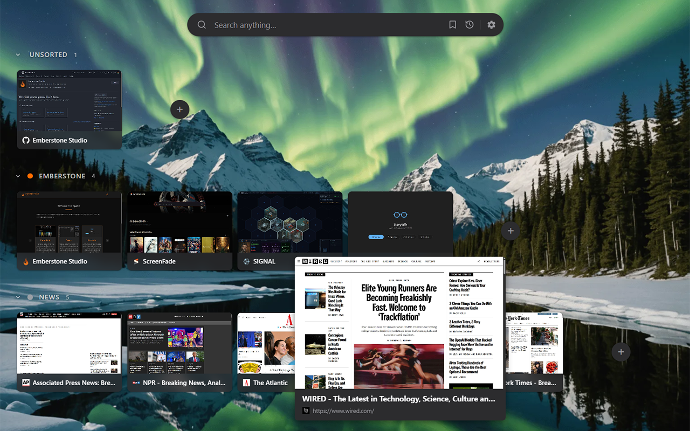

# Meridian

**Spatial tab command center** — a Chrome extension that replaces your new-tab page with a visual tab manager.



---

## Installation

Meridian is a local extension with no build step required.

1. Download the [latest release](https://github.com/Emberstone-Studio/Meridian/releases) and unzip.
2. Open Chrome and navigate to `chrome://extensions`.
3. Enable **Developer mode** (toggle in the top-right corner).
4. Click **Load unpacked** and select the unzipped folder.
5. Open a new tab — Meridian is live.

---

## Release checks

The automated release checks use Node.js 24 and Git. Run the local equivalents
from the repository root before manual Chrome validation:

```powershell
node --test tests/*.test.mjs

git ls-files '*.js' | ForEach-Object {
  node --check $_
  if ($LASTEXITCODE -ne 0) { throw "Syntax check failed: $_" }
}

node -e "for (const file of ['manifest.json', 'meridian-extension/manifest.json']) { JSON.parse(require('node:fs').readFileSync(file, 'utf8')); console.log('Parsed ' + file); }"

git diff --check
git diff --cached --check
git diff --check main...HEAD
```

The full test command includes `tests/packagedParity.test.mjs`, which fails
when the runtime mirror under `meridian-extension/` differs from the matching
root, `components/`, or `utils/` runtime source. The three Git commands check
unstaged changes, staged changes, and committed branch changes relative to
`main`, respectively.

---

## Privacy

See [PRIVACY.md](PRIVACY.md) for the extension's data handling, local and sync
storage, thumbnail capture, network behavior, permissions, the Chrome Web Store
Limited Use adherence statement, and the disclosure checklist.

Publisher-facing Chrome Web Store submission copy — the listing description,
Privacy Practices answers, per-permission justifications, and owner-only
follow-ups — lives in [STORE_LISTING.md](STORE_LISTING.md).

---

## Features

### Tab Cards & Workspace Lanes
Tabs are displayed as live thumbnail cards, organized into **workspace lanes** that map to Chrome tab groups or Meridian custom groups. Lanes are collapsible and support drag-and-drop tab reordering within and across groups.

### Lightbox Preview
Hover a tab card for 2 seconds to open a full-size preview lightbox showing the tab's thumbnail, title, and URL. Click to navigate to the tab, or press `Esc` to dismiss.

### Search Bar
A multi-engine search bar sits at the top of every new-tab page. Switch between **Google**, **DuckDuckGo**, **Bing**, and **Brave** with a single click on the engine logo. Your preference is saved across sessions.

### Local Search
Open-tab search is available by default. Bookmark and history search are
optional: Meridian asks for the corresponding Chrome permission only when you
enable that source in **Settings → Local Search** or select its search scope.
If access is denied or later revoked, that source stays off and Meridian does
not query its API.

### Theming
Choose **Light**, **Dark**, or **System** (follows OS preference). The selected theme is synced via `chrome.storage.sync`.

### Background Customization
Pick from:
- **Solid colors** — Black, Ink, Midnight, Forest, Plum
- **Gradient presets** — Midnight, Ocean, Dusk, Emerald, Amber, Bloom
- **Photos** — 12 curated images from Picsum (refresh for a new set)
- **Custom image** — upload any image from your device

### Tab Organization
Enable **Group unsorted tabs by domain** to automatically cluster ungrouped tabs by site, reducing visual noise.

### New Tab Behavior
Configure what happens when you open a new tab:
- Open a new Meridian view
- Always return to a pinned Meridian tab
- Open a custom homepage URL

### Thumbnails
Trigger a full thumbnail refresh from settings. The background service worker captures tab screenshots via `captureVisibleTab`.

Meridian keeps `<all_urls>` access installed for thumbnail capture. Chrome does
not allow `activeTab` to cover automatic captures after tab activation or page
load, so this access cannot be deferred to a click without removing the shipped
live-thumbnail behavior. Meridian also uses the installed `scripting`
permission and host access after a tab finishes loading to read that page's
meta description and H1/H2 text into the local open-tab search index. This
automatic indexing is what lets local search match page context beyond the tab
title and URL; it does not read form input or page-body text.

### Keyboard Navigation

| Key | Action |
|---|---|
| `Ctrl+Shift+M` | Focus your Meridian tab from anywhere in Chrome |
| `←` / `→` | Move between tabs within the current group |
| `↑` / `↓` | Move between groups (lanes) |
| `/` | Focus the search bar |
| `N` | Create a new group |
| `Esc` | Close lightbox / settings / blur search |
